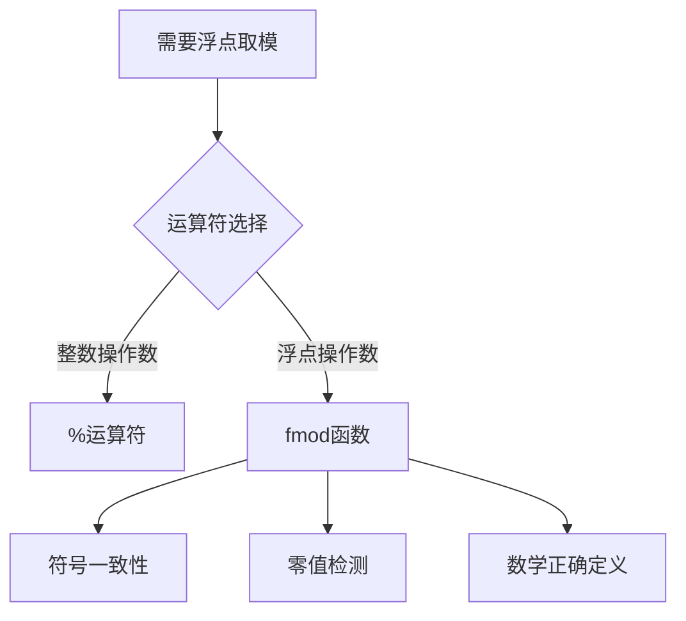

在C++计算器代码中使用`fmod`函数而非`%`运算符，主要基于以下关键原因：

---

### 1. 操作数类型差异
- **`%`运算符**  
  仅支持整数类型（int, long等），对浮点数会编译报错  
  ```cpp
  5 % 3   // 合法 → 2
  5.5 % 2 // 编译错误
  ```

- **`fmod`函数**  
  专门处理浮点数取模，支持double/float类型  
  ```cpp
  fmod(5.5, 2) // 返回1.5
  fmod(3.7, 1.5) // 返回0.7
  ```

---

### 2. 数学定义的精确性
- **负数处理差异**  
  | 运算式         | `%`结果 | `fmod`结果 | 数学定义          |
  |---------------|---------|------------|------------------|
  | `-5.5 % 2`    | 无效    | -1.5       | (-5.5) = (-3)*2 + (-1.5) |
  | `5.5 % -2`    | 无效    | 1.5        | 5.5 = (-2)*(-2) + 1.5    |

- **符号一致性规则**  
  `fmod`的结果符号始终与被除数（第一个参数）相同，这符合数学定义  
  ```cpp
  fmod(7.5, -3) // → 1.5 (符号同7.5)
  fmod(-7.5, 3) // → -1.5 (符号同-7.5)
  ```

---

### 3. 代码需求适配
- **浮点运算支持**  
  计算器设计要求支持`3.14%2.5`等浮点运算场景  
  ```cpp
  // 用户输入 "6.28%3.14"
  fmod(6.28, 3.14) // 精确返回0.0
  ```

- **错误处理优化**  
  `fmod`在除数为0时返回NaN，配合代码中的错误检测：  
  ```cpp
  case '%':
      if (b == 0) throw runtime_error("模零错误");
      values.push(fmod(a, b)); // 明确检测零值
      break;
  ```

---

### 4. 标准合规性
- **遵循ISO/IEC 10967-3**  
  `fmod`严格实现浮点取模的数学定义：  
  ```math
  fmod(a,b) = a - n*b
  ```
  其中n是截断整数（向零取整）

- **跨平台一致性**  
  使用标准库函数避免不同编译器对`%`扩展实现的差异

---

### 总结选择逻辑


通过`fmod`的使用，代码实现了：  
✅ 完整的浮点运算支持  
✅ 明确的错误处理机制  
✅ 跨平台计算一致性  
✅ 数学定义的精准实现
