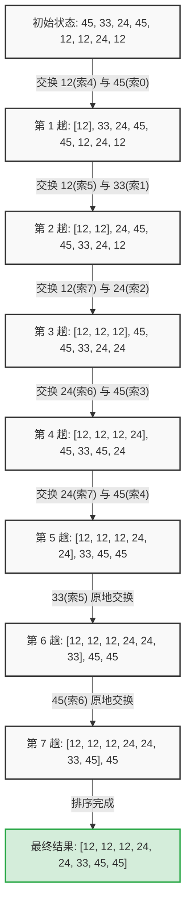

---
tags:
  - 组件库
---

**修改组件**：`oc-typography` 涉及：多行文本截断

### 1. 结构与渲染现状
*   **左侧正文**：普通的纯文本流，拥有标准的文字基线（Baseline）。
*   **右侧展开按钮**：它的最外层 `<a>` 容器（`.oc-operation-expand`）使用了 `display: inline-flex`。
*   **自定义内容**：在这个例子中，传入的自定义展开节点是一个复合结构，**排在最前面的是一个“向下箭头”的图标**（通常是 SVG 或带背景的 `<i>` 标签），后面跟着文本“展开啊啊...”。

### 2. 基线错位的核心原因
根据 CSS 规范，当一个 `inline-flex` 容器与外部文本混排时，它的默认行为是：**取容器内部“第一个 Flex 子元素”的基线，作为整个容器的基线，去与外部正文的基线对齐。**

*   **图标的基线陷阱**：在这里，容器的第一个子元素是那个“箭头图标”。对于 SVG 或图片等替换元素，它们默认的基线往往是**元素的底部边缘（Bottom Edge）**。
*   **对齐结果**：浏览器在渲染时，严格执行了规则——把“箭头图标的底部”与左侧正文“古人...”的文字基线对齐了。
*   **视觉偏差**：因为图标本身有一定高度，且按钮内部的文字（“展开啊啊...”）为了和图标平齐，通常使用了垂直居中对齐。这导致的结果就是：**图标的底部踩在了正文的基线上，把整个按钮容器（连同里面的文字）整体“顶”了上去**，从而产生了图中的向上偏差。

### 3. 如何验证与修复

要解决这个因为“首个元素是图标”带来的基线漂移问题，可以尝试以下几种方案：

*   **方案一：打破默认基线对齐（推荐业务侧处理）**
    在使用 `<oc-typography>` 时，通过 `expandNodeStyle` 属性强制改变这个 `inline-flex` 容器的垂直对齐参考点，不让它按默认的 baseline 对齐：
    ```vue
    <oc-typography :expand-node-style="{ verticalAlign: 'middle' }" />
    <!-- 或者根据实际高度尝试 verticalAlign: 'text-bottom' 或具体的数值如 '-2px' -->
    ```
*   **方案二：调整自定义组件的内部基线**
    修改传入的自定义渲染函数，确保那个箭头图标不会成为基线参考。例如给图标单独加上 `vertical-align: middle;`，或者让图标和文字包裹在一个设置了 `align-items: center` 的 Flex 容器中。
*   **方案三：组件库底层兼容**
    如果要在 `operations.vue` 组件库层面彻底解决这类自定义内容带来的错位，可以考虑在 `.oc-operation-expand` 样式中统一加上 `vertical-align: middle;`，但这需要回归测试是否会影响普通的纯字符串按钮（纯字符串通常不需要 `middle` 也能对齐得很完美）。


### 为什么在这里 margin-left: auto 无效？
在普通的行内文本流（Inline Flow）中，`margin-left: auto`是不起作用的 （它的计算值会被当作 0 ）。
因为行内元素没有“整行剩余空间”的概念，它们就像流水一样一个接一个排列。如果你把展开按钮的 `float: right` 改成 `margin-left: auto` ，它只会紧紧贴在最后一行文字的后面，而不会跑到容器的最右侧。


