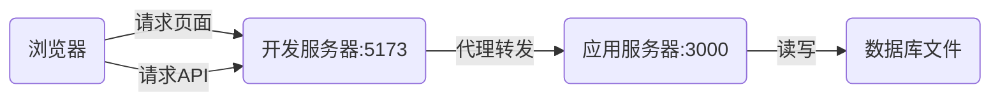
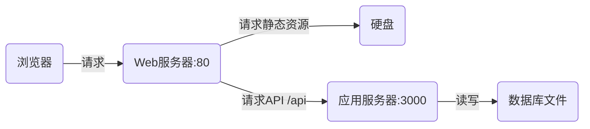

# 📝 学习笔记：软件服务器体系全解

## 1. 核心概念辨析

在讨论“服务器”时，首先要区分两个维度：

* **硬件服务器 (Hardware Server):** 物理层面的一台电脑（或云端虚拟机），有 CPU、内存和硬盘。它是**房子**。
* **软件服务器 (Software Server):** 运行在硬件上的**后台进程 (Process)**，监听特定端口，对外提供服务。它是房子里**干活的人**。

> **本笔记主要讨论“软件服务器”。**

---

## 2. 常见的软件服务器分类

根据职责不同，软件服务器主要分为以下四类：

### 🟢 第一类：Web 服务器 (Web Server)

* **代表软件：** **Nginx**, **Apache**, Microsoft IIS。
* **核心职责：**
1. **静态资源托管：** 极快地返回 HTML, CSS, JS, 图片等文件。
2. **反向代理 (Reverse Proxy):** 充当“二传手”，把请求转发给后端的应用服务器。
3. **负载均衡：** 把大量请求分发给多台后端机器。

* **餐厅比喻：** **门口的迎宾员**。
* 如果是拿菜单（静态文件），他直接递给你。
* 如果是点菜（业务逻辑），他把你带到座位上交给服务员。

* **生产环境地位：** 几乎必装。通常监听 `80` (HTTP) 或 `443` (HTTPS) 端口。

### 🔵 第二类：应用服务器 (Application Server)

* **代表软件：**
* Node.js 环境: **Koa**, **Express**, NestJS (你的后端)。
* Java 环境: **Tomcat**, Jetty。
* Python 环境: Gunicorn, uWSGI。

* **核心职责：**
1. **业务逻辑处理：** 计算、验证、鉴权。
2. **动态内容生成：** 也就是你的 API 接口。
3. **数据库交互：** 调用 ORM 操作数据。

* **餐厅比喻：** **大厨和服务员**。
* 负责真正的“做菜”（处理数据）。

* **你的项目：** 运行在 `localhost:3000` 的 Koa 进程就是应用服务器。

### 🟡 第三类：数据库服务器 (Database Server)

* **代表软件：** **MySQL**, **PostgreSQL**, MongoDB, Redis。
* **核心职责：**
1. **数据持久化：** 把数据存入硬盘，保证不丢失。
2. **查询引擎：** 高效地检索数据。

* **餐厅比喻：** **仓库管理员 / 冰箱**。
* **特殊情况 (SQLite):**
* 你的项目使用的是 **SQLite**，它是一种**嵌入式数据库**，没有独立的服务器进程，它只是一个文件。但在逻辑上，它依然承担了数据库服务器的角色。

### 🟠 第四类：开发服务器 (Development Server)

* **代表软件：** **Vite**, Webpack Dev Server。
* **核心职责：**
1. **即时编译 (JIT):** 把 TS/Vue/React 编译成浏览器能跑的 JS。
2. **热更新 (HMR):** 代码变动，浏览器局部刷新。
3. **本地代理：** 解决开发时的跨域问题。

* **生存周期：** **仅存在于开发阶段**。一旦项目打包 (`npm run build`)，它就功成身退了。
* **你的项目：** 运行在 `localhost:5173` 的进程。

---

## 3. 开发 vs. 生产：架构图解

为了更直观地理解，对比一下你的项目在两种环境下的服务器构成。

### A. 开发环境 (Development)

> *特点：为了开发爽，启动了多个服务。*

### B. 生产环境 (Production)

> *特点：为了性能和稳定，Vite 消失，Nginx 登场。*

---

## 4. 总结对比表

| 服务器类型 | 英文名称 | 典型代表 | 核心能力 | 你的项目中对应的是... |
| --- | --- | --- | --- | --- |
| **Web 服务器** | Web Server | Nginx | 静态文件、抗并发、反向代理 | 生产环境建议引入 Nginx，开发环境暂无 |
| **应用服务器** | App Server | Koa (Node.js) | 跑代码、算逻辑、连数据库 | `npm run dev` 启动的后端 (Port 3000) |
| **数据库服务器** | DB Server | MySQL / SQLite | 存取数据 | `dev.db` 文件 (通过 Prisma 访问) |
| **开发服务器** | Dev Server | Vite | 热更新、源码编译 | `npm run dev` 启动的前端 (Port 5173) |

## 5. 给开发者的建议

1. **不要搞混 Nginx 和 Node.js：** 虽然 Node.js 也能提供静态文件服务（如你的 `koa-static`），但在处理高并发静态文件时，Nginx 是专业的，Node.js 是业余的。生产环境通常是 "Nginx (前台) + Node.js (后台)" 搭配使用。
2. **理解 Vite 的本质：** 它只是你的“脚手架”和“编译工具”，不要指望上线后还依赖 Vite 的 proxy 功能，上线后要靠 Nginx 或 Koa 里的 CORS 来处理跨域。
3. **端口就是入口：** 只要是软件服务器，就一定占用端口。如果报错 `EADDRINUSE`，说明这个端口已经被另一个服务器占用了。

---

**下一步建议：**
如果你想深入了解生产环境的部署，建议你尝试搜索 **"Nginx 反向代理配置"**，看看它是如何把前端静态资源和后端 API 聚合在一个端口（通常是 80）下的。