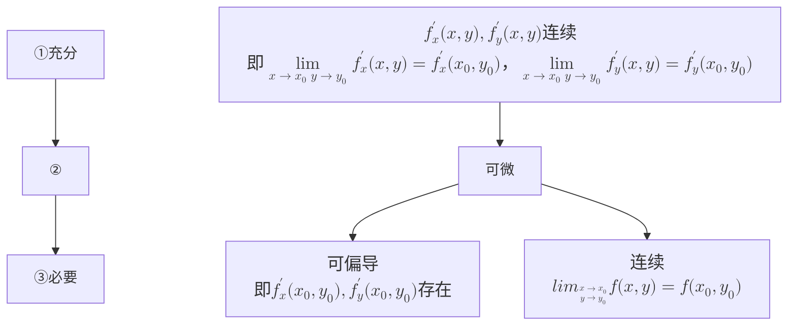

### 1.如何求偏导：
对于$z=f(x,y)$，求$z$在点$(x,y)$关于$x$的偏导数，则取$y$为常数，将函数对$x$求导，
如对于二元函数$z=x^2+xy+y^2$：
$$z_x'=\frac{\partial z}{\partial x}\bigg|_{(x_0,y_0)}=2x+y_0=2x_0+y_0$$

### 2.偏导数的几何含义

### 3.全微分的概念：
偏增量：$\Delta z_x=f(x_0+\Delta x,y_0)-f(x_0,y_0)$ 
全增量：$\Delta z=f(x_0+\Delta x,y_0+\Delta y)-f(x_0,y_0)$ 

### 4.偏导与连续：
$f(x,y)在(x_0,y_0)对x_0,y_0的偏导都存在\nRightarrow f(x,y)在(x_0,y_0)连续$ 
- 连续需要函数从每一个方向趋近$(x_0,y_0)$的极限都存在，而偏导是特定的

### 5.可微的必要条件
若$z=f(x,y)$在点$(x,y)$处可微，则偏导数$f_x'(x,y)$和$f_y'(x,y)$存在，且
$$dz=f_x'(x,y)\Delta x+f_y'(x,y)\Delta y$$

### 6.可微的等价条件
$$\begin{split}
函数 z = f (x, y) 在点 (x₀, y₀) 可微 &\Leftrightarrow \lim_{\substack{\Delta x \to 0 \\ \Delta y \to 0}} \frac{\Delta z - (A\Delta x + B\Delta y)}{\sqrt{(\Delta x)^2 + (\Delta y)^2}} = 0\quad(凑A、B）\\
&\Leftrightarrow \lim_{\substack{\Delta x\to0\\ \Delta y\to0}}{\frac{\Delta z-\left[f_x'(x_0,y_0)\Delta x+f_y'(x_0,y_0)\Delta y)\right]}{\sqrt{(\Delta x)^2+(\Delta y)^2}}=0\quad(求A、B)}
\end{split}$$
- 该极限的含义为$\Delta z - (A\Delta x + B\Delta y)$是$\sqrt{(\Delta x)^2 + (\Delta y)^2}$的高阶无穷小，即$o(\sqrt{(\Delta x)^2 + (\Delta y)^2})$，由全增量的定义推导

### 7.可微的条件关系

[[例题2]] 

### 8.高阶偏导数
$$f_{xy}''=\frac{\partial^2 z}{\partial x\partial y}=\frac{\partial}{\partial y} \left(\frac{\partial z}{\partial x}\right)$$
表达式为按顺序先对$x$求导再对$y$求导，但高阶混合偏导数在**连续**时求导顺序与结果无关（比如$f_{xxy}=f_{xyx}$）
$$\large\textbf{定理：}若在点 (x, y) 的邻域内，函数 z = f(x, y) 的偏导数 \frac{\partial z}{\partial x}、\frac{\partial z}{\partial y} 及 \frac{\partial^{2}z}{\partial x\partial y} 都存在，且 \frac{\partial^{2}z}{\partial x\partial y} 在点 (x, y) 处连续，那么混合偏导数 \frac{\partial^{2}z}{\partial y\partial x} 在点 (x, y) 处也存在，且 \frac{\partial^{2}z}{\partial x\partial y} = \frac{\partial^{2}z}{\partial y\partial x}。$$

### 9.切线、切平面的本质
**以直代曲：**
$\Delta y=A\Delta x+o(\Delta x)(A\Delta x为线性主部)$ *忽略高阶无穷小后* $\Rightarrow$
$y-y_0\approx f'(x_0)(x-x_0)$ 切线，导数值为斜率
$\Delta z=A\Delta x+B\Delta y+o(\sqrt{(\Delta x)^2+(\Delta y)^2})\Rightarrow$ 
$z-z_0\approx f'_x(x_0,y_0)(x-x_0)+f'_y(x_0,y_0)(y-y_0)$ 切平面，偏导值确定法向量
**以曲代曲：**
一元函数泰勒展开：一阶即为切线，其余为高阶无穷小
$$f(x) = f(x_0) + f'(x_0)(x - x_0) + \frac{f''(x_0)}{2!}(x - x_0)^2 + \cdots + \frac{f^{(n)}(x_0)}{n!}(x - x_0)^n + R_n(x)$$
二元同理

# 题型：
### 1.求全微分
### 2.求近似
$$f(x+\Delta x,y+\Delta y)≈f(x,y)+Adx+Bdy$$
### 3.判别可微性

偏导数和偏导函数

| $\Delta x：$ $dx：\Delta x\rightarrow 0$ |
| ----------------------------------------- |