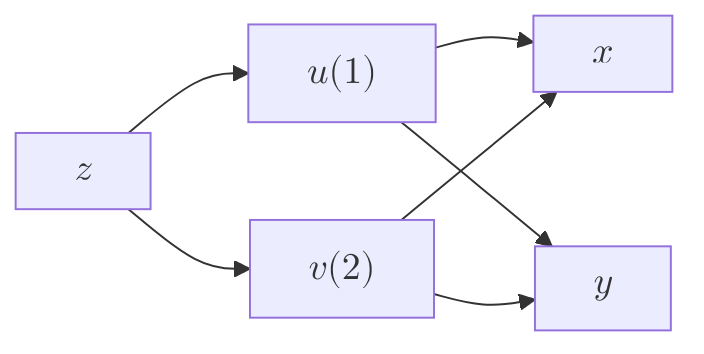

## 1.多元复合函数求偏导
### 1.1链式求导：
将复合函数中含有的未知量按层次连起来

$\Large \frac{\partial z}{\partial x}=\frac{\partial z}{\partial u}\cdot \frac{\partial u}{\partial x}+\frac{\partial z}{\partial v}\cdot\frac{\partial v}{\partial x}$ 
$\Large 简化：\frac{\partial z}{\partial u}=f_1'，\frac{\partial z}{\partial v}=f_2'$ 
### 1.2高阶链式求导：
对$f_1'$，$f_2'$同样通过链式法则进行运算，可以得到$f_{12}''$，$f_{11}''$等

## 2.隐函数求偏导
### 2.1三种求导方法：
#### 2.1.1 直接法
把$z$看作复合函数$z(x,y)$，对方程两边同时求偏导
#### 2.1.2 公式法
将方程移项化为$F(x,y,z)=0$，代入公式
$$\frac{\partial z}{\partial x}=\frac{F_x'}{F_z'}\quad
\frac{\partial z}{\partial y}=\frac{F_y'}{F_z'}$$ *公式并未推导*

#### 2.1.3 *全微分形式不变性*
两边求全微分，*可以不掌握*

### 2.2高阶求导
直接法：求出低阶偏导后，将z视为x与y的函数直接求导，再将低阶导数代入
![[Pasted image 20250610174442.png]]

## 3.隐函数&复合函数求偏导
先后使用隐函数、复合函数的求导方法即可

## 4.方程组确定的隐函数求导
对每个方程求导，得到线性方程组，用克拉默法则求解
$$\begin{cases}
a_{11}u_x'+b_{12}v_x'=m \\
a_{21}u_x'+b_{22}v_x'=n
\end{cases}$$

