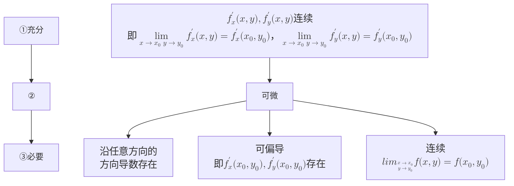

## 1.方向导数的定义
$$\lim_{t\to0}\frac{f(x_0+t\cos\alpha,y_0+\cos\alpha)-f(x_0,y_0)}{t}$$
*用处不大*

## 2.求方向导数公式
$$f(x,y)在P_0(x_0,y_0)处可微分\Rightarrow \frac{\partial f}{\partial l}\Bigg|_{(x_0,y_0)}=f_x'(x_0,y_0)\cos\alpha+f_y'(x_0,y_0)\cos\beta$$
其中$\cos\alpha$，$\cos\beta$为**方向余弦**，即$l$方向上的单位向量$\vec{e_l}=(\cos\alpha,\cos\beta)$ 

## 3.梯度定义：
$$\mathbf{grand}f(x_0,y_0)=\nabla f(x_0,y_0)=f_x'(x_0,y_0)\vec{i}+f_y'(x_0,y_0)\vec{j}=(f_x',f_y')$$
等位线：$f(x,y)=c$，梯度向量与等位线切线方向垂直且指向函数值上升的方向

## 4.梯度与方向导数：
$$\begin{split}
	&\begin{split} 
	\frac{\partial f}{\partial l}\Bigg|_{(x_0,y_0)}
	&= f_x'(x_0,y_0)\cos\alpha+f_y'(x_0,y_0)\cos\beta \\
	&=\nabla f(x_0,y_0)\cdot\vec{e_l} \\
	&=|\nabla f|\cdot \cos<\nabla f,\vec{e_l}> \\
	\end{split} \\
	&当l沿梯度向量方向时，方向导数最大，函数值上升速度最快，函数变化率最大 \\
	&沿梯度向量切线方向，变化率为0；\\
	&沿梯度向量反方向，函数值下降最快，变化率最小
\end{split}$$
梯度向量指向方向导数最大的方向

# 题型：
1.求方向导数