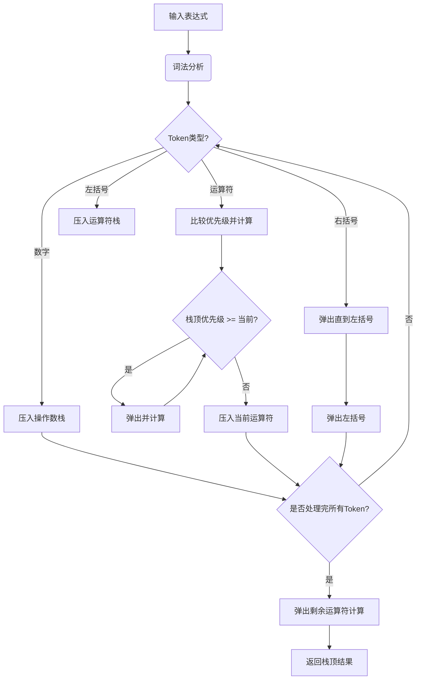

该代码中的语法解析器实现了**改进版的调度场算法**（Shunting Yard Algorithm），用于将中缀表达式转换为后缀表达式并求值。以下是具体实现细节的解析：

---

### 一、算法核心逻辑（以 `3 + 4 * (2 - 1)` 为例）

| 步骤 | 当前Token | 操作数栈 (values) | 运算符栈 (ops) | 动作说明 |
|------|-----------|-------------------|----------------|----------|
| 1    | 3         | [3]               | []             | 数字入栈 |
| 2    | +         | [3]               | [+]            | 运算符入栈 |
| 3    | 4         | [3,4]             | [+]            | 数字入栈 |
| 4    | *         | [3,4]             | [+,*]          | 高优先级运算符入栈 |
| 5    | (         | [3,4]             | [+,*,(]        | 左括号入栈 |
| 6    | 2         | [3,4,2]           | [+,*,(]        | 数字入栈 |
| 7    | -         | [3,4,2]           | [+,*,(,-]      | 运算符入栈 |
| 8    | 1         | [3,4,2,1]         | [+,*,(,-]      | 数字入栈 |
| 9    | )         | [3,4,1]           | [+,*]          | 计算括号内 `2-1=1` |
| 10   | -         | [3,4]             | [+]            | 计算 `4*1=4` |
| 11   | (结束)    | [7]               | []             | 计算 `3+4=7` |

---

### 二、代码关键逻辑解析

#### 1. 运算符优先级处理（`precedence()` 函数）
```cpp
int precedence(char op) {
    if (op == '+' || op == '-') return 1;  // 低优先级
    if (op == '*' || op == '/' || op == '%') return 2; // 高优先级
    return 0; // 括号的特殊处理
}
```

#### 2. 运算符栈处理逻辑
```cpp
while (!ops.empty() && precedence(ops.top()) >= precedence(token.op)) {
    applyOp(values, ops.top());  // 弹出并计算高优先级运算符
    ops.pop();
}
ops.push(token.op);  // 当前运算符入栈
```

#### 3. 括号处理
```cpp
else if (token.type == TokenType::RightParen) {
    while (!ops.empty() && ops.top() != '(') {  // 弹出直到左括号
        applyOp(values, ops.top());
        ops.pop();
    }
    ops.pop(); // 弹出左括号
}
```

---

### 三、与传统调度场算法的差异

| 特性              | 传统算法          | 本代码实现        |
|-------------------|-------------------|-------------------|
| 输出方式          | 生成后缀表达式队列 | 直接实时计算求值  |
| 存储结构          | 单独的输出队列    | 操作数栈动态计算  |
| 括号处理          | 仅转换不计算       | 实时计算括号内结果|
| 错误检测时机      | 转换后求值时检测   | 转换过程中即时检测|

---

### 四、算法优势

1. **单次遍历完成计算**  
   将中缀表达式转换和求值合并为一步，时间复杂度为 **O(n)**，比传统「先转换后求值」的两步法更高效。

2. **即时错误检测**  
   ```cpp
   void applyOp(stack<double>& values, char op) {
       if (values.size() < 2) throw ...; // 立即发现操作数不足
       if (op == '/' && b == 0) throw ...; // 立即检测除零错误
   }
   ```

3. **内存效率优化**  
   通过复用操作数栈，空间复杂度仅为 **O(n)**，而传统方法需要额外存储后缀表达式队列。

---

### 五、执行流程图示



通过这种改进实现，代码在保持算法核心思想的同时，优化了计算效率和错误处理能力。
