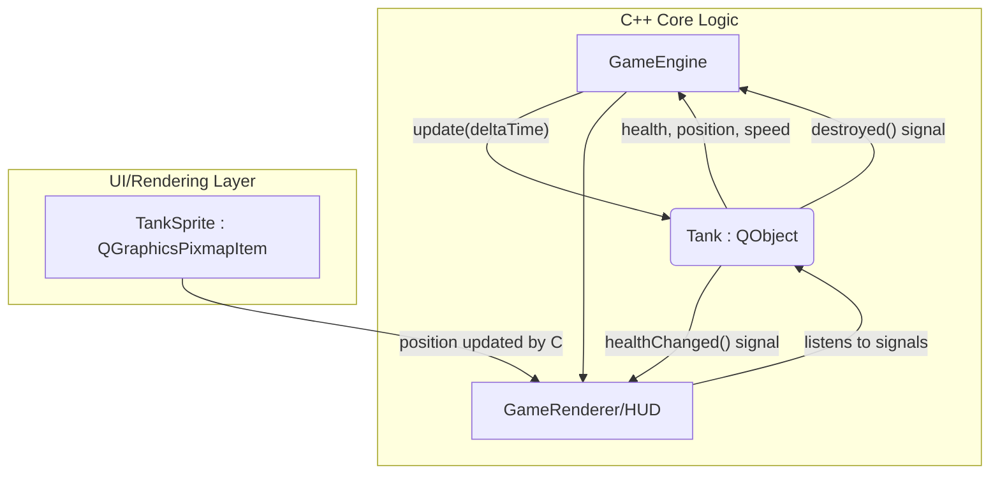

## QGraphicsPixmapItem 和 QObject辨析：
### **`QObject`：模型/数据核心**

`QObject` 是 Qt 框架的根基，它本身**与图形完全无关**。它是一个纯粹的数据和逻辑层面的类。

#### **核心特性：**
1.  **信号与槽 (Signals & Slots)**: 提供了一套强大的、类型安全的对象间通信机制，用于解耦。
2.  **属性系统 (Property System)**: 可以定义 `Q_PROPERTY`，轻松实现与QML的数据绑定或进行元编程。
3.  **父子对象树 (Parent-Child Hierarchy)**: 自动管理内存，父对象销毁时会自动销毁所有子对象。
4.  **事件处理 (Event Handling)**: Qt事件循环的基础，但它本身不处理图形事件如鼠标点击。
5.  **元对象系统 (Meta-Object System)**: 提供了运行时类型信息、动态函数调用等高级功能。

#### **在游戏中的角色：**
*   **纯粹的“游戏状态机”或“数据模型”**。
*   一个继承自 `QObject` 的 `Tank` 类，它只包含坦克的**数据**：生命值(`health`)、分数(`score`)、位置(`position`)、速度(`velocity`)。
*   它通过**信号**来通知外界自己的状态变化，比如 `healthChanged(int)` 或 `destroyed()`。
*   它完全不知道自己“长什么样”，也不知道自己是如何被画到屏幕上的。它只关心自己的逻辑状态。

#### **架构示意：**

**优点:**
*   **极致的解耦**：游戏逻辑（C++ `QObject`s）和图形表现（渲染层）完全分离。你可以轻易地为同一个游戏逻辑更换渲染引擎（比如从`QGraphicsView`换到纯`OpenGL`或`Vulkan`），或者甚至在没有界面的服务器上运行游戏逻辑。
*   **易于测试**：你可以对 `Tank` 对象进行单元测试，而无需创建一个窗口或图形环境。
*   **符合现代ECS（实体-组件-系统）思想**：`QObject` 扮演“实体”和“组件”的角色，而 `GameEngine` 中的各个系统（`PhysicsSystem`, `AISystem`）负责处理逻辑。

**缺点:**
*   **更繁琐的“胶水代码”**：你需要编写额外的代码来同步数据。例如，`GameRenderer`需要监听 `Tank` 对象的 `positionChanged` 信号，然后在自己的渲染循环中更新对应的 `QGraphicsPixmapItem` 的位置。你需要维护一个从 `GameObject` ID到 `QGraphicsItem` 指针的映射。

---

### **`QGraphicsPixmapItem`：视图/图形核心**

`QGraphicsPixmapItem` 是 `QGraphicsView` 框架中的一个具体类，它天生就是用来**显示一张位图**的。它继承自 `QGraphicsItem`，后者是场景中所有图形项的基类。

#### **核心特性：**
1.  **图形表现 (Visual Representation)**: 它的主要职责就是显示一张图片 (`QPixmap`)。
2.  **场景图成员 (Scene Graph Member)**: 它知道自己在 `QGraphicsScene` 中的位置(`pos()`)、旋转(`rotation()`)、缩放(`scale()`)和层级(`zValue()`)。
3.  **碰撞检测 (Collision Detection)**: `QGraphicsView` 框架为它提供了高效的碰撞检测方法 (`collidingItems()`)。
4.  **图形事件处理 (Graphics Event Handling)**: 它可以直接接收和处理鼠标事件 (`mousePressEvent`) 和键盘事件 (`keyPressEvent`，如果设置了焦点)。
5.  **不具备QObject的特性**: 它**没有**信号与槽、属性系统或自动的父子内存管理（它有自己的`parentItem()`，但这只关乎图形层级和变换，不直接等于内存管理）。

#### **在游戏中的角色：**
*   **“数据与视图合一”的对象**。
*   一个继承自 `QGraphicsPixmapItem` 的 `Tank` 类，它**既包含**坦克的逻辑数据（如你手动添加的`m_health`成员变量），**又包含**它的图形表现（它本身就是一张图片）。
*   它的移动就是直接调用 `setPos()`。它的销毁就是调用 `scene()->removeItem(this)`。

#### **架构示意：**
```mermaid
graph TD
    subgraph QGraphicsView Framework
        A[GameScene : QGraphicsScene]
        B(Tank : QGraphicsPixmapItem) -- health, position, pixmap --> B
        A -- contains --> B
    end
    C[GameEngine] -- game loop calls --> B[update(deltaTime)]
    B -- updates its own pos() --> B
```
**优点:**
*   **简单直观**：对于简单的2D游戏，这种方式非常快速和直接。数据和它的表现形式绑定在一起，少了很多中间层和同步代码。
*   **充分利用框架特性**：可以直接使用`QGraphicsView`框架提供的碰撞检测、事件处理等所有便利功能。

**缺点:**
*   **高度耦合**：游戏逻辑和图形表现紧密绑定。`Tank` 类必须存在于一个`QGraphicsScene`中才能正常工作。这使得逻辑的复用和独立测试变得困难。
*   **可扩展性受限**：如果游戏变得复杂，比如需要一个迷你小地图，你需要从 `Tank` 对象中提取位置信息再画一遍，而不能简单地让小地图也监听 `Tank` 的位置信号。

---

### **总结与选择**

| 特性 | `GameObject : public QObject` (模型优先) | `GameObject : public QGraphicsPixmapItem` (视图优先) |
| :--- | :--- | :--- |
| **核心身份** | 数据容器和逻辑单元 | 图形元素 |
| **图形相关** | **完全无关** | **核心职责** |
| **通信方式** | 信号与槽 | 直接函数调用或通过场景查询 |
| **内存管理** | 自动父子树 (`QObject` parent) | 手动管理或依赖场景销毁 |
| **耦合度** | **低** (逻辑与视图分离) | **高** (逻辑与视图合一) |
| **实现复杂度** | **较高** (需要胶水代码同步) | **较低** (直观，快速) |
| **适合场景** | 复杂项目、需要QML集成、强调可测试性和可扩展性的架构 | 简单2D游戏、快速原型开发、完全依赖`QGraphicsView`框架的项目 |
| **一句话总结** | **我的大脑（数据），需要别人帮我画出来。** | **我就是我的外表（图形），我自带数据。** |

**对于你的坦克大战项目，两种方式都可以。**

*   **如果你想快速做出一个能玩的原型**，并且不打算在未来做非常复杂的扩展，那么从 `QGraphicsPixmapItem` 继承是最快、最简单的路径。**我们之前的教程就是采用这种方式。**
*   **如果你追求一个更“工业级”、更健壮、更具扩展性的架构**，并且计划使用QML或者未来可能添加复杂的UI和网络功能，那么从 `QObject` 继承是更好的长期选择。这种方式的初始工作量稍大，但后期维护和扩展会更容易。

**混合方法 (Hybrid Approach):**
有时也会采用一种折中的方法：让 `GameObject` 同时继承 `QObject` 和 `QGraphicsPixmapItem`。

```cpp
class GameObject : public QObject, public QGraphicsPixmapItem {
    Q_OBJECT
    // ...
};
```
这种方法可以让你同时获得信号槽和图形项的所有功能。但它也有缺点：
1.  **多重继承的复杂性**: 增加了代码的复杂度和潜在的命名冲突问题。
2.  **违反单一职责原则**: 一个类既是数据模型又是视图，职责不清。
3.  **性能**: `QObject` 会增加每个图形项的内存开销。

通常来说，除非有非常明确的理由，否则**更推荐在“模型优先”和“视图优先”之间做出清晰的选择**，而不是混合它们。


## QRectF和QSizeF
- QRectF = 位置（x, y）+ 尺寸（width, height）
- QSizeF = 只有尺寸（width, height）
- QRectF有size()方法返回QSizeF